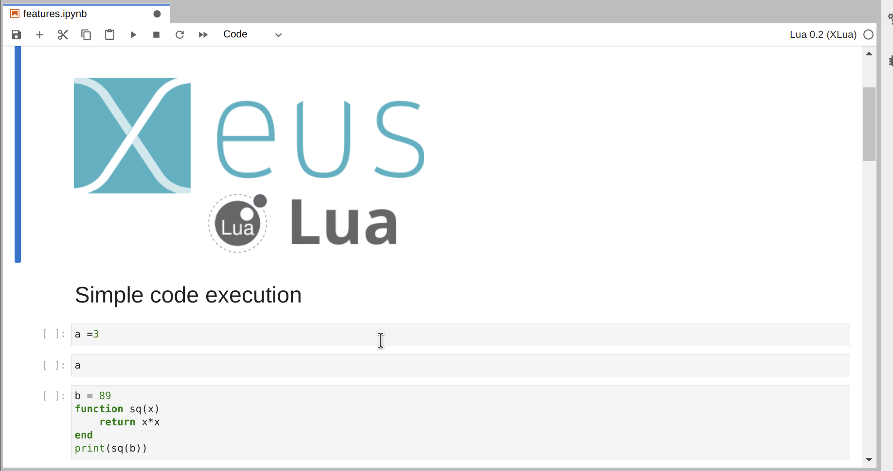
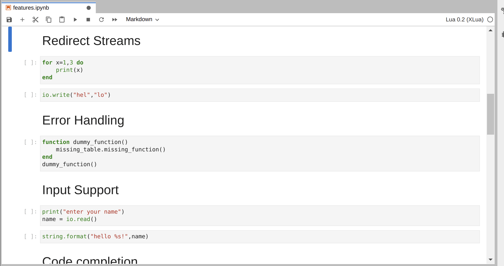
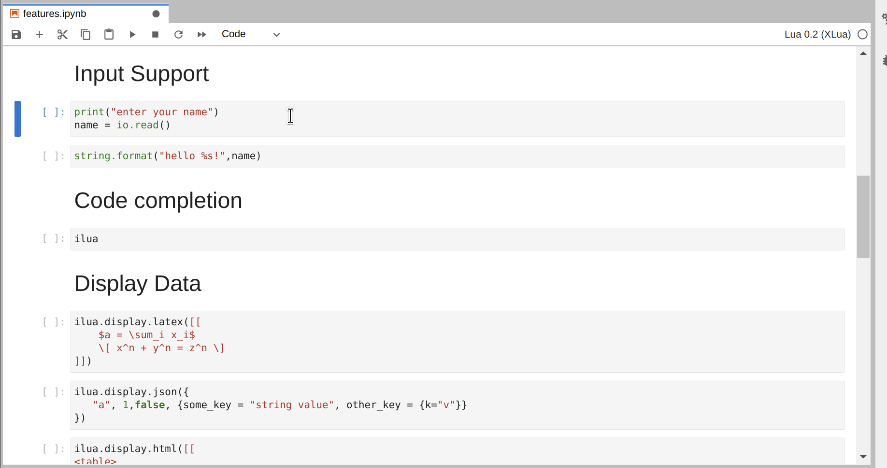
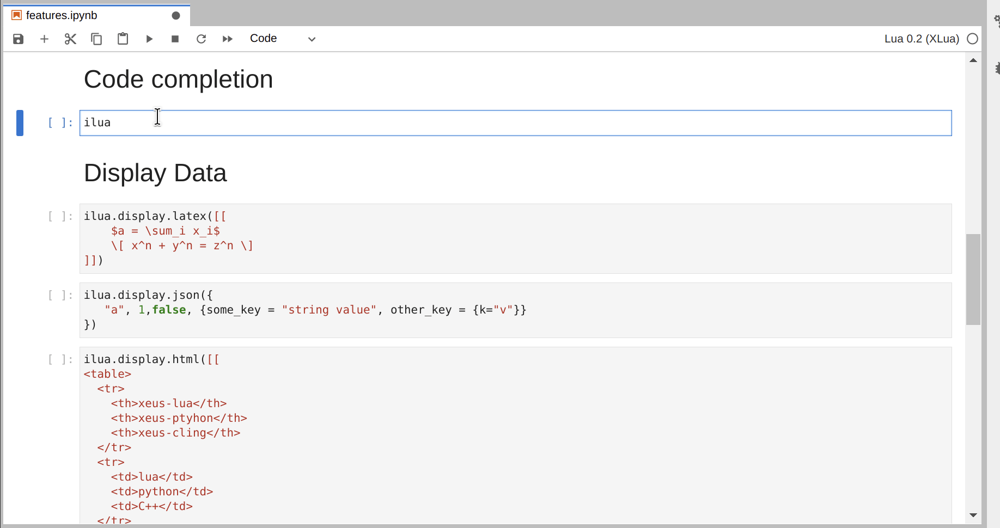
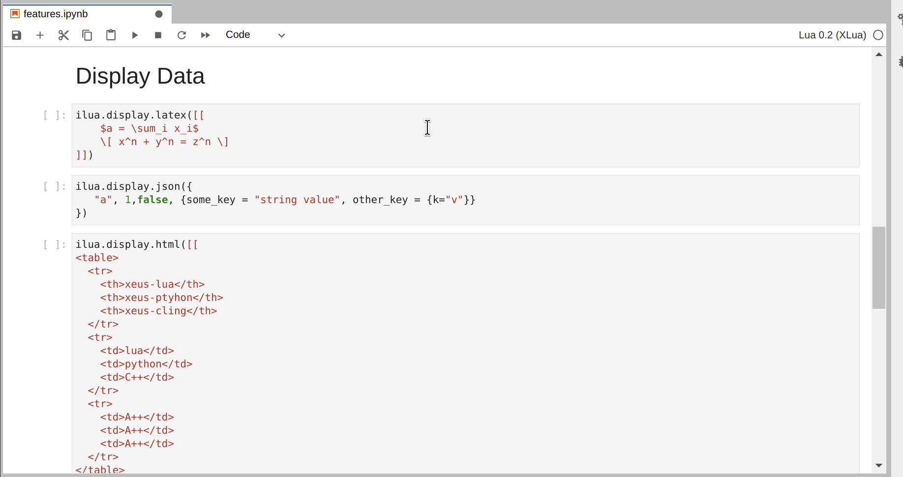
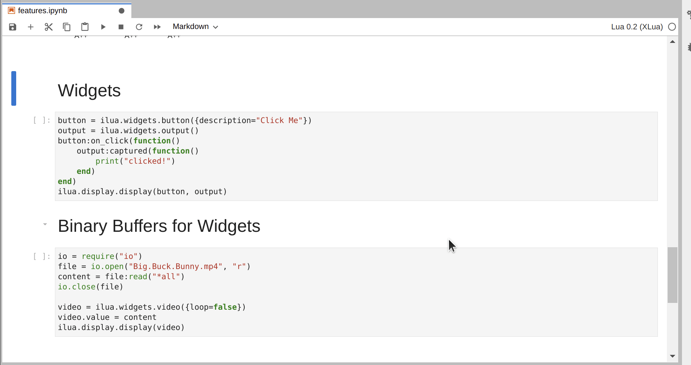

.. Copyright (c) 2021, Thorsten Beier
   Wolf Vollprecht

   Distributed under the terms of the BSD 3-Clause License.

   The full license is in the file LICENSE, distributed with this software.

Usage
=====

Launch the Jupyter notebook with `jupyter notebook` or Jupyter lab with `jupyter lab` and launch
a new Python notebook by selecting the **xlua** kernel.

Code execution and variable display
-----------------------------------

Output streams
--------------

Input streams
-------------

Error handling
--------------

.. image:: error.gif
   :alt: error_handling

Code completion
---------------

Display Data
------------

And of course widgets
---------------------

.. image:: buffers.gif
   :alt: widgets_binary

